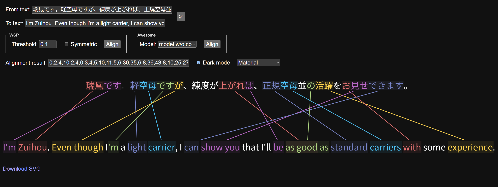

# Demonstration of AI/neural word alignment of English & Japanese text using mBERT-based machine learning models.<br>日本語と英語の文に対してmBERTベースの機械学習モデルを使用したAI・ニューラル単語アラインメントのデモ｡



[日本語版](README.ja.md)

I've created a visualization tool for experimenting with and comparing two state-of-the-art English–Japanese word alignment tools, both of which are based on [multilingual BERT](https://research.google/blog/open-sourcing-bert-state-of-the-art-pre-training-for-natural-language-processing/) but tackle the problem in different ways:

- [**WSPAlign**](https://github.com/qiyuw/WSPAlign), which is based on [earlier work by NTT](https://github.com/nttcslab-nlp/word_align), uses [question-answering](https://medium.com/analytics-vidhya/question-answering-system-with-bert-ebe1130f8def) to find the span in the _context_ ("to" text) corresponding to a marked word in the _question_ ("from" text), and repeats this for every word in the "from" text. _Note: This repo uses the WSPAlign [model](https://huggingface.co/qiyuw/WSPAlign-ft-kftt) only; the inference code is written from scratch as [the original](https://github.com/qiyuw/WSPAlign.InferEval) is not FOSS._

- [**awesome-align**](https://github.com/neulab/awesome-align) runs both sentences through the BERT model in order to extract the contextualized [word embeddings](https://is-rajapaksha.medium.com/bert-word-embeddings-deep-dive-32f6214f02bf) from "an empirically-chosen" layer of the model (see §2.1 of [the paper](https://arxiv.org/pdf/2101.08231)) and then performs a similarity comparison to identify probable word alignments. The advantage of this approach is it can process an entire sentence at once.

Both models (WSPAlign and the fine-tuned awesome-align models) are trained on [The Kyoto Free Translation Task (KFTT)](https://www.phontron.com/kftt/index.html) corpus which consists of 1,235 manually-aligned English–Japanese sentence pairs taken from Wikipedia articles about Kyoto. (WSPAlign is further trained on sentences in various languages scraped from Wikipedia and aligned heuristically; see §2.3 of [their paper](https://aclanthology.org/2023.acl-long.621.pdf).)

## Thoughts & conclusions　思考と結論

My initial hypothesis was that awesome-align's use of the actual word embeddings would produce better results than simply "asking" the AI to find the translation of a word wrapped in ¶ symbols, but surprisingly the reverse seems to be the case, at least in my testing. It's not perfect; as you can see above, the WSPAlign model made some mistakes, like mapping "experience" to 活躍 instead of 練度, mapping 上がれば to "as good as" (the difference in sentence structure seems to trip it up), or the rather novel interpretation of the honorific お.

I suspect the lack of adequate training data may be a problem: as far as I'm aware, KFTT is the only manually-word-aligned parallel corpus that exists for English & Japanese. It's also possible the way [mBERT's tokenization](https://github.com/google-research/bert/blob/master/multilingual.md#tokenization) handles Japanese is a factor: [all kanji words are split into single characters](https://qiita.com/tmitani/items/e520e0a085c9e4ee69ed) _(article in Japanese)_. I'd be curious to see if fine-tuning a model based on Tohoku University's [bert-japanese](https://github.com/cl-tohoku/bert-japanese) would improve accuracy, as it appears to use a better, Japanese-specific tokenizer leveraging MeCab.

That being said, it's quite impressive how much it gets right. I recommend trying it for yourself with different example sentences to see how the models perform.


## Running the visualization server　可視化サーバーの実行

```
$ git clone --recurse-submodules https://github.com/maxkagamine/word-alignment-demo.git
$ cd word-alignment-demo
$ python3 -m venv .venv && . .venv/bin/activate
$ pip install -r requirements.txt
$ ./visualize.py
```

The WSPAlign and BERT models will be downloaded automatically, but the fine-tuned "model_with_co" and "model_without_co" models for awesome-align need to be downloaded manually from the Google Drive links [in their readme](https://github.com/neulab/awesome-align?tab=readme-ov-file#model-performance) and extracted to a folder called "models" in the repo root.

## Related academic papers　関連学術論文

Wu, Q., Nagata, M., & Tsuruoka, Y. (2023). [WSPAlign: Word Alignment Pre-training via Large-Scale Weakly Supervised Span Prediction](https://aclanthology.org/2023.acl-long.621/). In _Proceedings of the 61st Annual Meeting of the Association for Computational Linguistics (Volume 1: Long Papers)_ (pp. 11084–11099). Association for Computational Linguistics.

Dou, Z.Y., & Neubig, G. (2021). [Word Alignment by Fine-tuning Embeddings on Parallel Corpora](https://arxiv.org/abs/2101.08231). In _Conference of the European Chapter of the Association for Computational Linguistics (EACL)_.

Nagata, M., Chousa, K., & Nishino, M. (2020). [A Supervised Word Alignment Method based on Cross-Language Span Prediction using Multilingual BERT](https://aclanthology.org/2020.emnlp-main.41/). In _Proceedings of the 2020 Conference on Empirical Methods in Natural Language Processing (EMNLP)_ (pp. 555–565). Association for Computational Linguistics.

